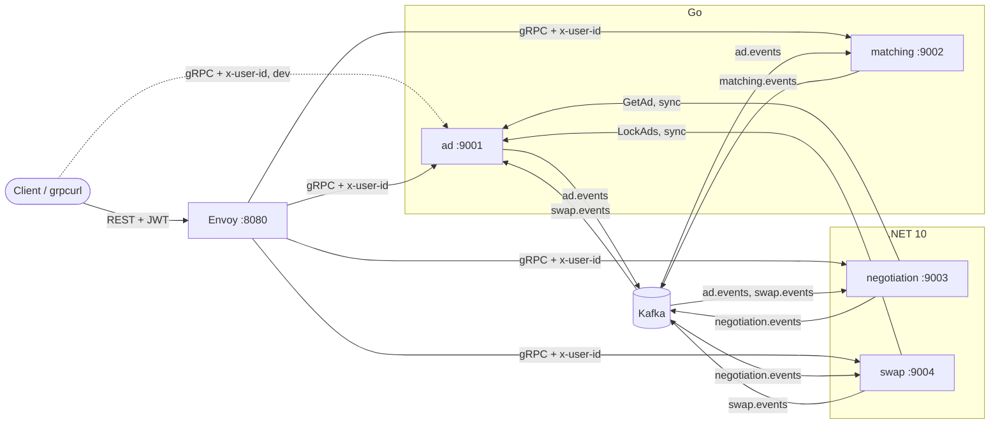
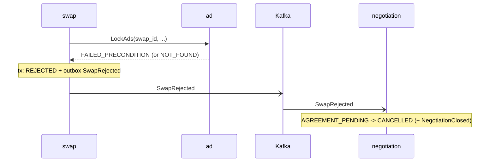
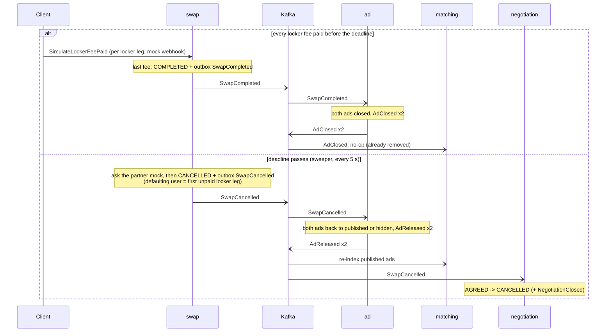
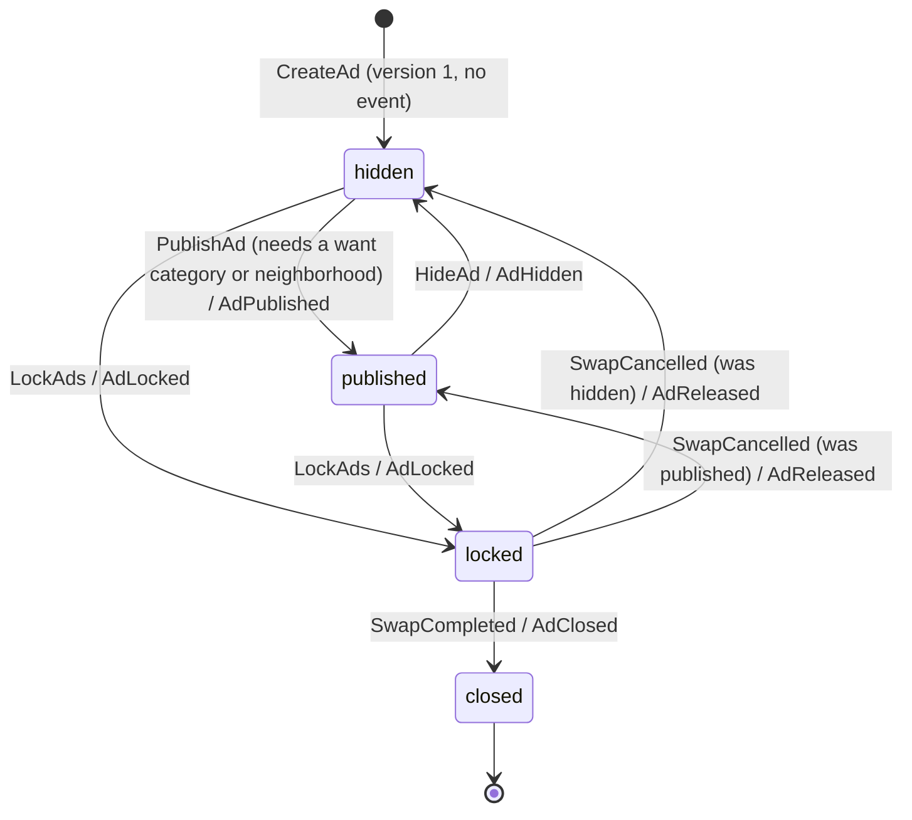
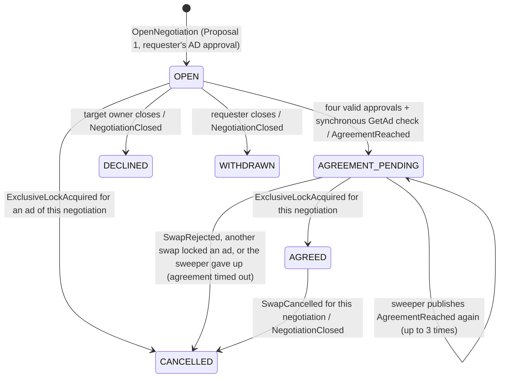
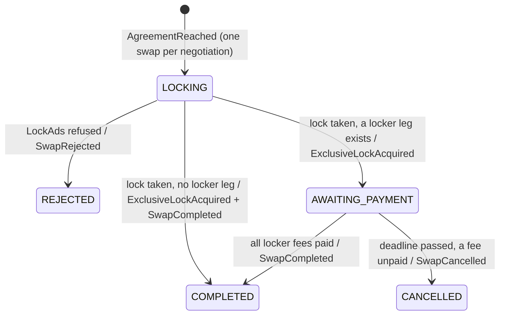

# MVP architecture (current state)

Status: describes the code as of 2026-10-09. Scope: the four services of the one-week MVP. It is derived from the code and tests, not from the plan; where they disagree the code is described and the difference is listed under [Known gaps](#known-gaps). The full design is in the root [README](../../README.md); the plan this build followed is [mvp-plan.md](../product/mvp-plan.md); the rules the services share are in [MVP service conventions](../guidelines/mvp-service-conventions.md).

Clients reach the services through an Envoy gateway (REST/JSON on `:8080`, JWT validated at the edge, gRPC transcoding; config in `gateway/`) or directly over gRPC. The gateway is only described where it affects identity and the API surface; see [API conventions](../guidelines/api-conventions.md) for the routes, [Running locally](../guidelines/running-locally.md) and the [demo walkthrough](../product/demo-walkthrough.md).

## Service map

| Service | Language | gRPC port | Database | Tables | Public RPCs | Publishes | Consumes (group) |
|---|---|---|---|---|---|---|---|
| ad | Go | 9001 | `ad` | `ad`, `ad_version`, `ad_lock`, `outbox`, `processed_events`, `dead_letter` | `CreateAd`, `EditAd`, `PublishAd`, `HideAd`, `GetAd`, `ListMyAds`, `LockAds` (only as `system:swap`) | `ad.events` | `swap.events` (`ad`) |
| matching | Go | 9002 | `matching` | `ad_index` (live rows and tombstones), `notified_pair`, `outbox`, `processed_events`, `dead_letter` | `Search`, `FindMatches` | `matching.events` | `ad.events` (`matching`) |
| negotiation | .NET 10 | 9003 | `negotiation` | `negotiation`, `proposal`, `approval`, `ad_ref`, `outbox`, `processed_events`, `dead_letter` | `OpenNegotiation`, `ApproveAd`, `ReviseProposal`, `ApproveProposal`, `RejectProposal`, `CloseNegotiation`, `GetNegotiation`, `ListNegotiations` | `negotiation.events` | `ad.events`, `swap.events` (`negotiation`) |
| swap | .NET 10 | 9004 | `swap` | `swap`, `outbox`, `processed_events`, `dead_letter` | `GetSwap`, `ListMySwaps`, `SimulateLockerFeePaid` (dev only) | `swap.events` | `negotiation.events` (`swap`) |

Shared code: `libs/goplatform` (Go) and `libs/dotnet/Taakht.Platform` (.NET) hold the identity interceptors, migrations runner, outbox writer and relay, and idempotent consumer. They have the same responsibilities in both languages; no code is shared across languages, only the Protobuf contracts in `api/proto`.

Infrastructure (`deploy/docker-compose.yml`): one Postgres 17 instance with one database per service, and one single-node Kafka (KRaft) whose auto-created topics get 3 partitions. Services run on the host, not in containers.



## Data ownership

Each service reads and writes only its own database. Copies of other services' data are read models fed by events:

| Data | Owner | Copies elsewhere |
|---|---|---|
| Ad head (`status`, `current_version`, `event_seq`), immutable `ad_version` snapshots, lock claims (`ad_lock`) | ad | matching `ad_index` (published ads with their full snapshot, plus tombstone rows for removed ads that only keep `last_seq`; built from `ad.events`); negotiation `ad_ref` (id, owner, current version; built from `AdPublished`/`AdEdited`/`AdReleased` and refreshed from every synchronous `GetAd`) |
| Negotiation, Proposals (immutable, numbered), approvals | negotiation | swap receives what it needs inside `AgreementReached` (both ads with versions and owners, the agreed terms). The two ads are also shown on every `Negotiation` response, read live from `ad.GetAd` and never stored |
| Swap, legs, fee flags, payment deadline | swap | none (ad and negotiation learn the outcome from events) |
| `MatchFound` dedupe (`notified_pair`) | matching | none |

Identity is the `x-user-id` gRPC metadata key, read by one interceptor per language (an opaque token of 1..64 printable ASCII bytes (0x21-0x7E: no spaces, control characters or non-ASCII), identical in the Go and .NET libs; a repeated `x-user-id` or `x-internal-token` header is rejected too; anything else is `UNAUTHENTICATED`); there is no token validation in the services. Envoy verifies the JWT and writes `sub` into `x-user-id`, replacing anything the client sent. Outgoing calls forward the header, except the two service identities:

- `system:swap`: the Swap service's `LockAds` call. `LockAds` rejects any other caller with `PERMISSION_DENIED`.
- `system:negotiation`: Negotiation's `GetAd` calls, set explicitly in the call metadata. For `GetAd`, the ad's owner and any `system:*` caller read anything (any version, any status); everyone else gets only a `PUBLISHED` ad at its current version and `NOT_FOUND` otherwise. Negotiation authorizes the real caller itself.

Service identities need proof: a `system:` `x-user-id` counts only with the metadata `x-internal-token` equal to the shared secret `INTERNAL_AUTH_TOKEN` (constant-time comparison; default `dev-internal-token` locally, DEV ONLY, with a startup warning while it is in use). The identity interceptor of each service answers `UNAUTHENTICATED` to a `system:` id without a valid token, and the client interceptors attach the token on calls made as `system:*`. Trust assumption: normal user ids are believed as sent (the gateway overwrites the header from the JWT; service ports are not meant to be reachable by clients). The gateway also strips a client-sent `x-internal-token`, denies a JWT whose `sub` starts with `system:` (rbac filter), and `tools/devtoken` refuses to mint such ids. Seed users are `user-1` to `user-4` in `config/eligibility.json`, together with the allowed categories and neighborhoods (with coordinates). Ad validates specs against that file; matching reads it for the distance part of the score.

**Existence of ads.** `GetAd` answers `NOT_FOUND "ad not found"` with one fixed message for a missing ad and for an ad the caller may not see, and `OpenNegotiation` answers `NOT_FOUND "ad not available"` for a missing ad, for a requester ad owned by someone else and for a target ad that is not published, so a caller cannot probe which ad ids exist or are hidden. `PERMISSION_DENIED` remains for negotiation calls by a non-party.

**Counterpart visibility.** Every `Negotiation` the service returns (open, approve, revise, reject, close, get, list) carries `requester_ad` and `target_ad`: the two ads as the Ad service shows them now (current version, spec included), fetched as `system:negotiation`. Only the two parties can get a negotiation, so only they see the counterpart's ad. A list fetches each distinct ad once; an ad that cannot be read leaves its field empty (logged), the call still succeeds.

## Synchronous calls (gRPC)

| Caller | Callee | Call | Timeout | When | On failure |
|---|---|---|---|---|---|
| negotiation | ad | `GetAd` (current version, as `system:negotiation`) | 5 s | opening a negotiation (both ads), `ApproveAd` (the other side's ad), and when all four approvals look valid locally (both ads, the final check) | `NotFound` becomes a domain error; any other error (for example `Unavailable`) propagates to the caller and the negotiation is unchanged |
| negotiation | ad | `GetAd` again, to fill `requester_ad` / `target_ad` of every response | 3 s | after each negotiation call, one fetch per distinct ad | the field stays empty and a warning is logged; the call does not fail |
| swap | ad | `LockAds(swap_id, [(ad_id, version)] x2)` (as `system:swap`) | 10 s | handling `AgreementReached` | `FailedPrecondition`, `NotFound`, `InvalidArgument` and `PermissionDenied` are permanent refusals and end in a rejection (`SwapRejected`); any other error throws, so the consumer retries |

## Asynchronous events (Kafka)

Every event is a `taakht.common.v1.Envelope` (`event_id`, `type`, `aggregate_id`, `occurred_at`, serialized payload). Each service publishes only to its own topic, written through its outbox; the Kafka key is the aggregate id shown below. Consumers skip envelope types they have no handler for. `AdPublished`, `AdEdited` and `AdReleased` are the only ad events negotiation reads (it updates `ad_ref` from their snapshot); matching reads all six. Every ad event carries `seq`, the ad's `event_seq` counter at the time (see below).

| Event | Topic | Producer | Kafka key | Consumers and effect |
|---|---|---|---|---|
| `AdPublished` (full snapshot, `seq`) | `ad.events` | ad | ad id | matching: upsert into the index and emit `MatchFound`; negotiation: update `ad_ref` |
| `AdEdited` (full snapshot, `seq`) | `ad.events` | ad | ad id | matching: upsert if the snapshot is published, else remove (tombstone); negotiation: update `ad_ref` (this is what turns approvals stale) |
| `AdHidden` (ad id and `seq` only, no snapshot) | `ad.events` | ad | ad id | matching: remove from the index (tombstone) |
| `AdLocked` (ad id, swap id, `seq`) | `ad.events` | ad | ad id | matching: remove from the index (tombstone) |
| `AdReleased` (swap id, full snapshot, `seq`) | `ad.events` | ad | ad id | matching: upsert if published, else remove; negotiation: update `ad_ref` |
| `AdClosed` (ad id, swap id, `seq`) | `ad.events` | ad | ad id | matching: remove from the index (tombstone) |
| `MatchFound` | `matching.events` | matching | ad id | none; matching also logs a `MATCH` line |
| `NegotiationOpened` | `negotiation.events` | negotiation | negotiation id | none |
| `NegotiationClosed` (status, reason) | `negotiation.events` | negotiation | negotiation id | none. Written on decline, withdraw and every cancel (including an `AGREED` negotiation cancelled by `SwapCancelled` and an `AGREEMENT_PENDING` one cancelled by the sweeper), not on agreement |
| `AgreementReached` (both ads with versions and owners, terms) | `negotiation.events` | negotiation | negotiation id | swap: create the swap and take the lock (idempotent by negotiation id). Published again by the sweeper while the negotiation stays `AGREEMENT_PENDING`; a malformed one (missing ad, empty ad id) with a negotiation id ends in a `REJECTED` swap with reason `malformed agreement` and a `SwapRejected`, one without a negotiation id is logged at error level |
| `ExclusiveLockAcquired` (swap id, negotiation id, both ad ids) | `swap.events` | swap | swap id | negotiation: only if the named winner exists, concerns exactly those ads and is `AGREEMENT_PENDING` (or already `AGREED`): mark it `AGREED` and cancel every other live negotiation that involves either ad. Otherwise the event is stale and ignored |
| `SwapRejected` | `swap.events` | swap | swap id | negotiation: cancel the negotiation if it is still `AGREEMENT_PENDING` |
| `SwapCompleted` (swap id, ad ids, negotiation id) | `swap.events` | swap | swap id | ad: close both ads (negotiation ignores it) |
| `SwapCancelled` (swap id, ad ids, reason, defaulting user, negotiation id) | `swap.events` | swap | swap id | ad: restore both ads to the status held before the lock; negotiation: the `AGREED` negotiation named by `negotiation_id` becomes `CANCELLED`. Only an event without that field (published before it existed, still in flight) falls back to the `AGREED` negotiation of the ad pair |

`AdLocked`, `AdClosed` and `AdReleased` carry the swap id. A new ad is created `hidden` and no event is written for the creation; the first event of an ad is `AdPublished` (or `AdEdited`).

**Ordering with `seq`.** The `ad` row has an `event_seq` counter. Every event the Ad service writes for an ad increments it in the same transaction (under the ad's row lock) and carries the new value as `seq`, so `seq` follows commit order per ad. Matching keeps `last_seq` per ad in `ad_index` and ignores any event with `seq <= last_seq`. A removal (`AdHidden`, `AdLocked`, `AdClosed`, or an `AdEdited`/`AdReleased` whose snapshot is not published) leaves a tombstone row (`removed = true`, `last_seq`) instead of deleting, so a replayed or reordered older event cannot bring the ad back; a strictly newer event re-adds it (`AdReleased` re-publishes the same version after a lock, which is why a version check alone is not enough). Search and `FindMatches` ignore tombstones. Events without `seq` (value 0, written before the counter existed) are applied with the old version check and never override sequenced state.

## The lock saga

The exclusive lock is claimed in the Ad service, in one database transaction, and driven by the Swap service. The Negotiation service never calls `LockAds`.

```mermaid
sequenceDiagram
  autonumber
  participant C as Client
  participant N as negotiation
  participant A as ad
  participant K as Kafka
  participant S as swap
  participant M as matching

  C->>N: ApproveProposal (fourth valid approval)
  N->>A: GetAd (both ads, sync)
  A-->>N: current versions
  Note over N: tx: status = AGREEMENT_PENDING<br/>+ outbox AgreementReached
  N-->>C: negotiation (AGREEMENT_PENDING)
  N-)K: AgreementReached (via outbox relay)
  K-)S: AgreementReached
  Note over S: insert swap LOCKING (unique per negotiation)
  S->>A: LockAds(swap_id, [(ad_a, v), (ad_b, v)])
  Note over A: tx: row locks in id order, check status + version,<br/>status = locked, ad_lock rows, outbox AdLocked x2
  A-->>S: ok
  Note over S: tx: AWAITING_PAYMENT (or COMPLETED)<br/>+ outbox ExclusiveLockAcquired
  A-)K: AdLocked x2
  K-)M: AdLocked: remove from index
  S-)K: ExclusiveLockAcquired
  K-)N: ExclusiveLockAcquired
  Note over N: winner AGREED; competing live negotiations CANCELLED<br/>(+ NegotiationClosed each)
```

If the Ad service refuses the lock (an ad is locked, closed, or at another version than the agreed one), the swap goes to `REJECTED`:



After a successful lock the swap waits for locker fees. Legs with delivery method `LOCKER` owe a fee; a swap without locker legs completes at once (and emits both `ExclusiveLockAcquired` and `SwapCompleted`).



Race on one ad: two negotiations on ad A reach agreement at the same time. Each produces its own `AgreementReached` and its own swap. Both swaps call `LockAds`; the Ad service locks the ad rows `FOR UPDATE`, so the second transaction sees the ad already `locked` and answers `FAILED_PRECONDITION`. That swap becomes `REJECTED`, and its negotiation ends `CANCELLED` (by `SwapRejected`, or earlier by the winner's `ExclusiveLockAcquired`, whichever arrives first; the second is a no-op). `TestLockAdsConcurrentOverlap` exercises this in the Ad service.

## State machines

### Ad

`status` and `current_version` live on the `ad` row; every version of the spec is an immutable `ad_version` row.



`EditAd` is allowed only in `published` and `hidden` and needs `expected_version` to equal the current version (`ABORTED` otherwise). If the normalised spec equals the stored current spec it returns the current ad unchanged (no new version, no event, so approvals and the index are not disturbed); otherwise it creates version n+1 and emits `AdEdited` with the full snapshot. The previous status is kept in `status_before_lock` for the release. Only the owner can edit, publish or hide.

### Negotiation



Each party gives two approvals: `AD` (target = the version of the other side's ad) and `TERMS` (target = the number of the active Proposal). Proposals are numbered, immutable and never reused; `ReviseProposal` creates number n+1 and counts as the author's `TERMS` approval; `RejectProposal` makes the previous Proposal active again (only one level of history is kept). Once in `AGREEMENT_PENDING` the parties can no longer change anything.

**The `AGREEMENT_PENDING` sweeper.** A `BackgroundService` in negotiation runs every 30 s. A negotiation that has been `AGREEMENT_PENDING` for `AGREEMENT_PENDING_TIMEOUT` (default `10m`, min `10s`, max `30d`) is not cancelled, because the swap may be mid-flight (a slow `LockAds`, a stuck partition, a lost event). Instead `AgreementReached` is written to the outbox again with the originally agreed ad versions (stored on the negotiation row), `republish_count` goes up and `last_republished_at` is set. Each following timeout period repeats this, up to 3 times; the swap service creates the swap once per negotiation id and repeats an idempotent `LockAds`, so a republished event is harmless. If the negotiation is still `AGREEMENT_PENDING` one period after the third republish, it becomes `CANCELLED` with reason `agreement timed out` and a `NegotiationClosed` is written. The whole recovery therefore takes `4 x AGREEMENT_PENDING_TIMEOUT` (40 minutes by default). What a late event does afterwards: `SwapRejected` for the now `CANCELLED` negotiation is ignored (nothing left to cancel); `ExclusiveLockAcquired` for it is ignored too, with an error log naming the swap, because the handler marks a negotiation `AGREED` only from `AGREEMENT_PENDING`. That last case is the residual risk: if the swap was only very slow and takes the lock after the timeout, the ads stay locked and the swap proceeds (and can complete) while the negotiation shows `CANCELLED`; the competitors it would have cancelled are cancelled only when their own lock attempt fails with `SwapRejected`. It needs an operator to reconcile; nothing repairs it automatically.

### Swap



The deadline is `PAYMENT_DEADLINE` (default `1h`; the demo uses `2m`) counted from the moment the lock is taken.

## Approval validity, versions and staleness

An approval stores its target and is never deleted or invalidated. Whether it is valid is computed every time it is read:

- `AD` approval: valid while its target equals the current version of that ad as known to the Negotiation service (`ad_ref`, fed by `AdEdited` events and refreshed from each synchronous `GetAd`).
- `TERMS` approval: valid while its target equals the number of the active Proposal.

Because `ad_ref` is eventually consistent, the fourth approval is not trusted locally: Negotiation calls `GetAd` for both ads and recomputes validity against those versions before it writes `AgreementReached`. The agreed versions travel in the event, and `LockAds` checks them again against the Ad database, which is the authority. See [bind approvals to versions](../adr/drafts/bind-approvals-to-versions.md).

## Idempotency and outbox mechanics

Writer side (every service that publishes, see [transactional outbox](../adr/drafts/use-a-transactional-outbox-for-events.md)):

- A business change and its event rows are written in one database transaction (`outbox.Add` in Go, `Outbox.AddAsync` in .NET). Rows are inserted with `created_at = clock_timestamp()` so events written in one transaction keep their order.
- One relay loop per service polls every 200 ms for up to 100 unpublished rows, `ORDER BY created_at, id ... FOR UPDATE SKIP LOCKED` (`id` breaks ties between equal timestamps), produces them to Kafka with `acks=all`, waits for the acknowledgement, then sets `published_at`. A crash between the acknowledgement and the commit publishes the rows again: delivery is at-least-once.

Reader side (every service that consumes, see [processed events](../adr/drafts/make-consumers-idempotent-with-a-processed-events-table.md)):

- For each known event, the consumer inserts `(group, event_id)` into `processed_events` with `ON CONFLICT DO NOTHING` and runs the handler in the same transaction. If nothing was inserted, the event was already handled and is skipped. The Kafka offset is committed after the transaction.
- A failing handler is retried with backoff (200 ms doubling to 5 s) and blocks its partition. A handler can instead report a permanent failure (`consume.Permanent` in Go, `PermanentEventException` in .NET). The consumer then logs it at error level, records the event in `processed_events` and stores the envelope and the error in `dead_letter` in one statement (the handler's writes are rolled back), and moves on, so one poison message cannot block the partition. `dead_letter (consumer, event_id, topic, payload, error, created_at)` is for inspection and manual replay; there is no replay tool, and rows older than `DEAD_LETTER_RETENTION` (default `30d`) are pruned by housekeeping. Payloads that fail to decode, an invalid event id, and a `LockAds` refusal with `InvalidArgument` or `PermissionDenied` (which becomes a rejected swap) are treated this way; every other error is transient and retried forever. The .NET consumer survives `KafkaException` on consume and commit (log and back off). An undecodable envelope (no readable event id) is logged at error level and skipped without a record, as is a handled event type whose event id is not a UUID (it cannot be keyed in `processed_events` or `dead_letter`).
- Groups start from the earliest offset.
- Handlers also check state, because events can arrive twice or late: Ad's swap handlers only touch ads whose `ad_lock` row for that swap is still `locked`; Matching ignores a snapshot older than the indexed version; Negotiation's handlers act only on negotiations in the expected status; Swap transitions are state-checked functions (`SwapMachine`) applied under a row lock with an `UPDATE ... WHERE status = <status read>`.

Lock idempotency: `LockAds` is idempotent by `swap_id`. The `ad_lock (swap_id, ad_id)` primary key records the claim and the agreed version. A retry with the same ads and versions returns success if the swap's lock is still held; a retry with different ads or versions is `FAILED_PRECONDITION`; a retry after release or close is `FAILED_PRECONDITION`. The Swap service also makes the swap row itself idempotent (`UNIQUE (negotiation_id)`, `INSERT ... ON CONFLICT DO NOTHING`), so a redelivered `AgreementReached` finds the existing swap and repeats the same `LockAds`. See [the lock ADR](../adr/drafts/take-the-exclusive-ad-lock-in-the-ad-service.md).

## Failure behavior

Derived from the code; none of this was exercised by a fault-injection test, apart from the redelivery and retry cases covered by the tests listed in each service README.

| What fails | Effect | Recovery |
|---|---|---|
| Kafka unavailable | Business operations keep working: events stay in the outbox (`published_at IS NULL`). The relays log errors and retry every poll interval. Consumers get fetch errors and process nothing. Read models go stale (matching index, negotiation `ad_ref`), and no saga step that needs an event advances (a negotiation stays `AGREEMENT_PENDING`, a swap is never created) | Relays drain the outbox in `created_at` order, consumers continue from their committed offsets, duplicates are absorbed by `processed_events` |
| ad down | Ad RPCs fail. Negotiation cannot open, approve an ad, or reach agreement (`GetAd` times out after 5 s; the negotiation is unchanged). Swap's `LockAds` fails with a transient error: the `AgreementReached` handler throws and is retried with backoff, which blocks the rest of that partition of `negotiation.events`. Matching still answers `Search` from its index (possibly stale) | Ad restarts; the blocked handler succeeds on a retry; `LockAds` is idempotent |
| matching down | No search or match notification. Nothing else depends on it | Restart; it consumes `ad.events` from its committed offset (or from the earliest on first start) and then emits any missing `MatchFound` |
| negotiation down | No new negotiations or approvals. `AgreementReached` events already published to Kafka are still processed by swap and the ads are locked; one still in the negotiation outbox waits for the restart (the relay runs inside the service). `ExclusiveLockAcquired` waits in Kafka | On restart the negotiation moves to `AGREED` and competitors are cancelled |
| swap down | `AgreementReached` waits in Kafka; ads stay unlocked and the negotiation stays `AGREEMENT_PENDING`; after `AGREEMENT_PENDING_TIMEOUT` the sweeper publishes the event again (3 times, then cancels the negotiation). No fee simulation and no deadline sweep | On restart swaps are created and locked (a duplicate from the sweeper is a no-op); overdue swaps are cancelled on the first sweep (every 5 s) |
| A service's Postgres down | That service's RPCs fail, its relay and consumers retry. Other services continue and see its events late | Restart; the outbox and offsets make the work resume |
| Crash after `LockAds` committed but before the swap row was updated | Swap stays `LOCKING` and the consumer offset is not committed | The event is redelivered, the existing swap is found, `LockAds` returns success again, the swap moves on |
| Crash after an outbox row was produced but before `published_at` was set | The event is produced twice | Consumers dedupe by `event_id` |
| A handler fails with a permanent error (undecodable payload, rejected business input) | The event is logged at error level, recorded in `processed_events` and stored in `dead_letter` with the error; later events continue | Inspect `dead_letter` (and the service log); replay is manual, there is no tool |
| A handler fails with a transient or unknown error that never clears | Its partition is blocked, retrying forever with a 5 s backoff cap | Manual: fix the cause or the data |

## Differences from the full design

| Area | Full design (README / architecture decisions) | MVP |
|---|---|---|
| Services | Ad, Matching, Deal (negotiation and settlement), Reputation, Communication, Delivery | Ad, Matching, Negotiation, Swap. Reputation and Communication are not built; `MatchFound` and cancellations are log lines or unconsumed events |
| Delivery, KYC, locker partner, auth | External providers behind ports | In-process mocks: `ILockerEligibility` (rejects `user-4` when a Proposal asks for a locker leg of that user), `IDeliveryProvider` (reports what `SimulateLockerFeePaid` recorded). Locker fees are simulated through an RPC that exists only when `ENABLE_DEV_ENDPOINTS=true` or the .NET environment is Development, and a caller can mark only their own leg paid |
| Edge | Envoy, REST transcoding, JWT at the edge | Built: Envoy on `:8080` transcodes REST to gRPC and validates HS256 dev JWTs against a static key in `gateway/envoy.yaml` (`tools/devtoken` signs them). No real identity provider, no key rotation. The dev route `/v1/dev/swaps/...` is routed unconditionally at the edge |
| Search | Elasticsearch, Redis geo index | Postgres table `ad_index` filtered in SQL, scored in Go; six static neighborhoods with coordinates |
| Outbox relay | CDC (Debezium) considered | Polling relay in each service |
| Eligibility Config | Managed configuration | A static JSON file validated by Ad and read by Matching |
| Open-negotiation cap | Per requester Ad, with auto-hide when capped | `NEGOTIATION_CAP` (default 10) counts live negotiations (`OPEN` and `AGREEMENT_PENDING`, as requester or target) per ad, at open time. No auto-hide |
| Reputation, penalties | `PaymentTimedOut` feeds Reputation | `SwapCancelled` carries `defaulting_user_id`; nobody consumes it for reputation |
| Expiry, TTL, home page, Pricing, Hotspots, item-condition claims | Designed | Cut |
| Payment deadline | One hour | Configurable (`PAYMENT_DEADLINE`), 1 h default, 2 min in the demo |
| Deployment | Independent deployables | Processes on the host; one Postgres instance with four databases; one Kafka node |
| Observability, load tests | Designed | Log lines only; no load or fault-injection results are recorded here (the `tests/e2e` suite and `scripts/demo.sh` cover the functional flows) |
| Service-to-service auth | Shared `INTERNAL_AUTH_TOKEN` proves `system:*` callers now; mTLS in production ([ADR draft](../adr/drafts/authenticate-service-to-service-calls.md)) | One secret for all services, no rotation; see [Identity](#data-ownership) |
| gRPC reflection | n/a | Off by default; on with `TAAKHT_GRPC_REFLECTION=on` (Go) or the Development environment (.NET). `scripts/dev.sh` turns it on for all four |

## Known gaps

Differences between the plan and the code, and weaknesses that remain. Gaps that were found earlier and have since been fixed are not listed.

1. **Lock query.** The plan describes one conditional `UPDATE ... WHERE status IN (...) AND current_version = $v`. The code takes `SELECT ... FOR UPDATE` row locks on both ads in id order, checks status and version in Go, then updates. The guarantee (atomic, all-or-nothing, serialized per ad) is the same. There are no `ReleaseAds` or `CloseAds` RPCs; release and close happen only when the Ad service consumes `SwapCancelled` and `SwapCompleted`.
2. **Status names.** The plan says a client reads `AgreedLocked` or `Cancelled`. The code uses `AGREEMENT_PENDING`, `AGREED` and `CANCELLED`.
3. **`AGREEMENT_PENDING` recovery is bounded and has a residual risk.** The sweeper republishes `AgreementReached` three times and then cancels (see above), but a swap that locks the ads after the negotiation was cancelled for timing out leaves the negotiation `CANCELLED` while the swap runs on (an `ExclusiveLockAcquired` for a `CANCELLED` negotiation is ignored and logged; no automatic repair). A swap stuck in `LOCKING` is only retried through those republished events; nothing reconciles it otherwise.
4. **No terminal negotiation status for a completed swap.** `SwapCompleted` leaves the negotiation `AGREED`. A cancelled swap now cancels its `AGREED` negotiation, but the ads are then available again and the users must open a new negotiation.
5. **`system:` identity trust.** `system:*` callers are authenticated by one shared secret (`INTERNAL_AUTH_TOKEN`), not by per-service identity: there is no rotation, anyone holding the secret or able to read internal traffic (plaintext gRPC) can claim any `system:` identity, and the local default `dev-internal-token` is public. Production needs mTLS or per-service signed tokens ([ADR draft](../adr/drafts/authenticate-service-to-service-calls.md)).
6. **Consumer transaction across a gRPC call.** The platform consumer opens its dedupe transaction before the handler runs, and the swap handler performs the `LockAds` call inside that window (it ignores the transaction it is given and uses its own short ones). The dedupe transaction, and the connection, are therefore open and idle for up to the 10 s call timeout.
7. **`dead_letter` is a parking table, not a DLQ.** Permanently failed events are kept there (payload and error, pruned after `DEAD_LETTER_RETENTION`), but nothing alerts on them and there is no replay tool. A transient error that never clears (a handler bug) still blocks its partition.
8. **Relay assumptions and growth.** One relay per service is assumed. `SKIP LOCKED` would let two relays publish different batches in parallel, so global `created_at` order across them is not guaranteed; only per-key order within one relay is. Published `outbox` rows (older than `OUTBOX_RETENTION`, 24h), `processed_events` rows (older than `PROCESSED_EVENTS_RETENTION`, 7d) and `dead_letter` rows (older than `DEAD_LETTER_RETENTION`, 30d) are pruned by the housekeeping job; the cost is that a redelivery older than the processed-events retention would be handled twice.
9. **`MatchFound` once per pair, forever; tombstones are kept forever.** `notified_pair` is never cleared, so an ad that is released and re-indexed does not produce a second `MatchFound` for the same pair. Likewise the tombstone rows in matching's `ad_index` (one small row per removed ad) are never pruned.
10. **Hidden ads can be negotiated and locked.** `Lockable` is published or hidden, and the requester's own ad may be hidden when a negotiation is opened. The target ad must be published at open time.
11. **Ad edited between agreement and lock.** The lock is refused (version mismatch), the swap is `REJECTED`, the negotiation is `CANCELLED`, and the users must negotiate again.
12. **Simulation endpoint is a mock.** `SimulateLockerFeePaid` is limited to the caller's own leg and is disabled outside development, but it is still a stand-in for a partner webhook that does not exist.
13. **Table list in the plan** names only the main tables; `ad_lock`, `ad_ref`, `notified_pair` and `processed_events` are additions.
14. **Not measured.** No load test results are recorded here and no fault-injection test kills a service or Kafka in the middle of the saga; the failure table above is derived from the code and from unit/integration tests of the redelivery cases.
15. **Legacy events without the new fields.** Events written before `seq` (ad events) and `negotiation_id` (`SwapCompleted`, `SwapCancelled`) existed carry the default values. Matching applies seq-less events with the old version check and never lets them override sequenced state; negotiation falls back to the ad-pair lookup for a `SwapCancelled` without a negotiation id. Both fallbacks exist only for events that were in flight during the upgrade.
16. **Counterpart ads cost a synchronous call.** Each negotiation response makes up to two extra `GetAd` calls (3 s timeout each, in parallel). While the Ad service is down, reads are slower by that timeout and come back without the ads.
